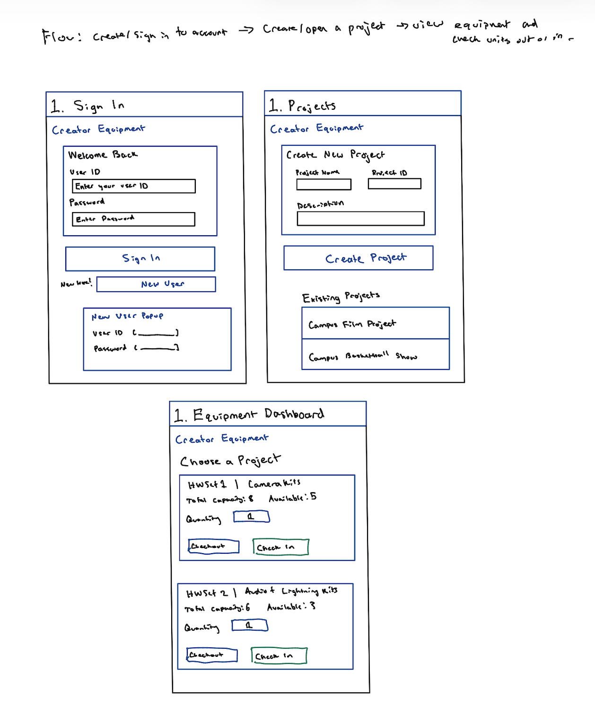

# Project Overview

Creator Equipment as a Service is a web application that helps students and campus organizations manage shared media equipment. Users can create an account and project, view available equipment, check out items for a project, and check them back in when finished.

For our proof of concept, HWSet1 represents camera kits and HWSet2 represents audio and lighting kits. The application will show each set's total capacity and current availability, with the option to add more equipment types later.

## Project Plan

### Team Members

Kavi Daliparti, Akash Maiti, Shreyas Kumar, Saharsh Lavu, Sanjay Senthil

### Sprint Cadence

We plan to work in one-week sprints. At the beginning of each sprint, we will choose tasks from our GitHub Project board and assign them to team members. At the end of each sprint, we will review completed work and plan the next sprint.

Our initial estimated velocity is 6–8 story points per sprint. We will adjust this estimate after the first sprint based on how much work we actually complete.

### Collaboration and methodology

We will use an Agile approach. GitHub will hold our shared code and documentation, and a GitHub Project board will track planned work. We will use GitHub Issues to track bugs and improvements. Team members will review each other's changes through pull requests and meet regularly to discuss progress and blockers.

### Collaboration Tools

### Implementation Methodology

### Toolchain

## Product Features

### User Stories

### Technical Debt

### Research Items

## High Level Sketch

